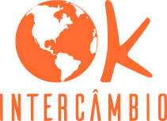

<h1 align="center">
    
</h1>

<b>⚖ Wordpress theme developed for Ok Intercambio, an exchange agency based at Brazil and Ireland</b>
<ul align="center">
    
    
</ul>

## 🎲 PROJECT DESCRIPTION
Project architected and developed by:
<ul>
    <li>Jordy Muniz Araújo (Designer UX/UI)</li>
    <li>Arthur Anthunes Rangel da Silva (Designer UX/UI)</li>
    <li>Maria Eduarda Ferreira Leandro (Designer UX/UI)</li>
    <li>Iago Wesley Irineu Costa (Front-end Developer)</li>
    <li>Francisco Márcio da Silva Oliveira Júnior (Front-end Developer)</li>
    <li>Reinaldo da Silva Nascimento (Front-end Developer)</li>
    <li>Caio Brandão da Costa (Front-end Developer)</li>
</ul> 

## 💻 TECHNOLOGIES

### Prototype
<ul>
    
</ul>

### Front-end
<ul>
    
    
    
    
</ul>

<h1> </h1>

Made with ❤ by <a href="http://www.codijr.ufc.br">Container Digital Jr.</a>

